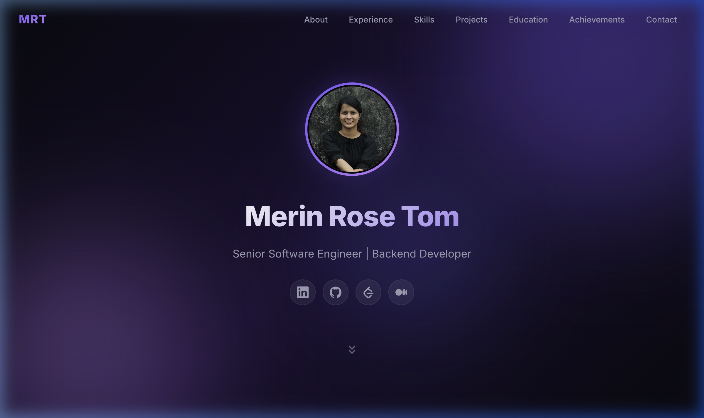

# 🚀 Portfolio Website — GitHub Pages Workshop

A simple, customizable portfolio website you can deploy to GitHub Pages in minutes. **No frameworks, no build tools** — just HTML, CSS, and JavaScript.



---

## 📋 Quick Start (Step-by-Step)

### Step 1: Fork This Repository

1. Click the **Fork** button at the top-right of this GitHub page
2. This creates your own copy of the project under your GitHub account

### Step 2: Clone Your Fork

Open a terminal and run:

```bash
git clone https://github.com/MerinRose123/portfolio.git
cd portfolio
```

> Replace `MerinRose123` with your actual GitHub username.

### Step 3: Customize Your Portfolio

Open **`config.js`** in any text editor — this is the **only file you need to edit**.

Update the fields with your own information:

```js
const CONFIG = {
  name: "Your Name",
  title: "Your Job Title",
  email: "your@email.com",
  address: "Your City, Country",
  summary: "A short professional summary about yourself...",
  // ... update experience, skills, projects, education, etc.
};
```

**Replace `profile.png`** with your own photo (keep the same filename, or update `profileImage` in `config.js`).

### Step 4: Preview Locally (Optional)

Open `index.html` directly in your browser to see your changes.

### Step 5: Push Your Changes

```bash
git add .
git commit -m "Customize portfolio with my details"
git push origin main
```

### Step 6: Enable GitHub Pages

1. Go to your repository on GitHub
2. Click **Settings** → **Pages** (in the left sidebar)
3. Under **Source**, select **Deploy from a branch**
4. Choose **main** branch and **/ (root)** folder
5. Click **Save**

Your portfolio will be live at:

```
https://MerinRose123.github.io/portfolio/
```

> It may take 1–2 minutes for the site to appear.

---

## 📁 Project Structure

```
portfolio/
├── config.js      ← ✏️ Edit this to customize your portfolio
├── index.html     ← Page layout (no need to edit)
├── style.css      ← Styling (no need to edit)
├── profile.png    ← 📸 Replace with your photo
└── README.md      ← You're reading this!
```

---

## 🎨 What You Can Customize (in config.js)

| Field            | Description                                |
| ---------------- | ------------------------------------------ |
| `name`           | Your full name                             |
| `title`          | Job title / tagline                        |
| `email`          | Contact email                              |
| `address`        | Your location                              |
| `profileImage`   | Filename of your profile photo             |
| `socialLinks`    | LinkedIn, GitHub, LeetCode, Website, etc.  |
| `summary`        | Professional summary paragraph             |
| `experience`     | Work history with roles and bullet points  |
| `skills`         | Skills grouped by category                 |
| `projects`       | Project details with descriptions          |
| `education`      | Degree, institution, GPA, honors           |
| `achievements`   | Awards and recognitions                    |
| `certifications` | Professional certifications                |

---

## 💡 Tips

- **Profile photo**: Use a square image for best results. Name it `profile.png` or update the `profileImage` field in `config.js`.
- **Social links**: Add or remove entries in the `socialLinks` array. Supported icons: `linkedin`, `github`, `leetcode`, `globe`, `medium`.
- **Rename the repo**: If you rename your repo to `MerinRose123.github.io`, it becomes your main GitHub Pages site at `https://MerinRose123.github.io/`.

---

## 📄 License

Free to use and modify. Happy coding! 🎉
